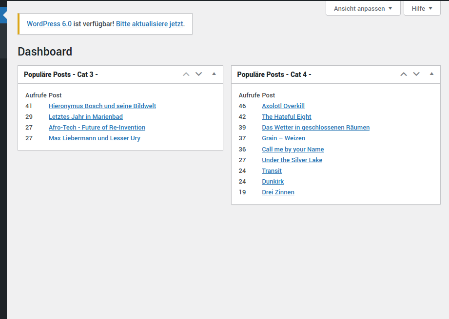

# Wordpress Plugin: Popular Posts from a Matomo instance

Use your matomo data for things like "popular posts" or "Most read posts"
Be GDPR safe and do not send your user's data around the internets ( like i.e. jetpack does )

## Features:
- gives you an option page to connect to a matomo
- by default it queries matomo for the "most popular posts of today"
- provides dashboard widgets showing simple stats in backend
- caches results in a transient
- js is used to render the results

## Installation
This plugin is a blueprint for developers.
Its not made for typical WordPress end-user, so no simple click-install.
Clone or download, move to wp-content-plugins and 
*- important -* read the code and adjust it to your needs.

## Screenshot 

## Tags: 
#wordpress, #matomo, #plugin, #developer-plugin, #most-read, #popular-posts
#CMB2

## Links
https://developer.matomo.org/api-reference/reporting-api#VisitsSummary

## Todo: 
- make this more end-user friendly 
- publish on worpdress plugins
- translation 

## Licence

The code in this project is licensed under GNU GENERAL PUBLIC LICENSE Version 3.

